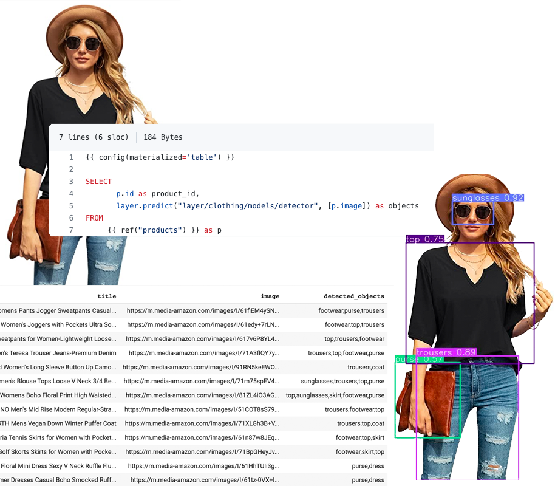

# Cloth Detection in dbt DAG



This dbt project shows how to extract the cloth information in product images with a simple SQL inside dbt DAG, like the following:

```sql
SELECT
    id,
    layer.predict("layer/clothing/models/objectdetection", ARRAY[image])
FROM
    {{ ref("products") }}
```

## How it works?

We introduce a SQL function called `layer.predict()` as you can see above.
With this function, you can fetch any ML model from the Layer repository and apply it to your data from within the dbt DAG.

When you run the above sql:

1. Layer fetches the `products` table with the required `id` and `image` columns from your BigQuery DWH.
2. Layer fetches [this computer vision model](https://app.layer.ai/layer/clothing) from [Layer](https://layer.ai/) as specified in the predict function with `layer/clothing/models/objectdetection`
3. Layer reads all the images from the products table and extract what's in the image and return it to dbt to store the extracted information in a BigQuery table.

## How to run

First, install the open-source [Layer dbt Adapter](https://github.com/layerai/dbt-adapters). Right now, we only support BigQuery (more to come soon)

```shell
pip install dbt-layer[bigquery] -U -q
```

Now, install the required libraries. This ML model is a fine-tuned YOLOv5 model, so we have to install the required libraries for YOLOv5 to run.

```shell
git clone https://github.com/ultralytics/yolov5
pip install -r yolov5/requirements.txt
```

Then, add a new BigQuery profile to your [dbt profile](https://docs.getdbt.com/dbt-cli/configure-your-profile/). Name it as `layer-profile`, and don't forget to set `type: layer_bigquery` for Layer to work.
Here is a sample profile:

```yaml
layer-profile:
  target: dev
  outputs:
    dev:
      type: layer_bigquery
      method: service-account
      project: [GCP project id]
      dataset: [the name of your dbt dataset]
      threads: [1 or more]
      keyfile: [/path/to/bigquery/keyfile.json]
```

Clone this repo:

```shell
git clone https://github.com/layerai/examples-dbt
cd examples-dbt/cloth_detector
```

And seed the sample [products table](seeds/products.csv) which contains a sample of random product images from Amazon

```shell
dbt seed
```

Finally, you can run the project:

```shell
dbt run
```

When the project runs, Layer fetches the product image urls from the `ref('products')`, loads the corresponding image, and detects the objects in the
product image.
The detected objects are be saved in a new dbt model called [cloth_detections](models/products/cloth_detections.sql) as a column containing comma-separated values, like `shirt,trousers,shoes`. This dbt model is finally written as a table in your BigQuery database.

## Computer Vision Model

We are using a YOLOv5 model trained with a custom dataset.

You can check the following notebook to see how this model
works and how to make predictions with it:

https://colab.research.google.com/drive/1I9U7Q02d5BXCTmVO-JLWYsKeIL7Mug9p

Here is a link to the Layer project if you want to learn more about this model:

https://app.layer.ai/layer/clothing
