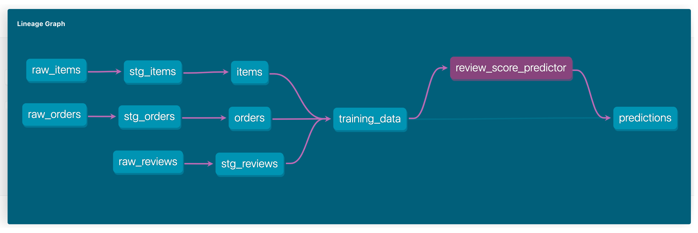

# Predicting Order Review Scores in the dbt DAG

In this e-commerce example walk through, you will train a machine learning model to predict order review scores in the middle of dbt DAG with the opensource [Layer dbt Adapter](https://github.com/layerai/dbt-adapters). The Layer dbt Adapter lets you easily enhance your dbt pipelines with machine learning (ML) workloads.

You will use `layer.automl()` functionality to train an AutoML model based on the Brazilian e-commerce company, [OLIST’s datasets](https://www.kaggle.com/datasets/olistbr/brazilian-ecommerce).  

This is all the SQL you need to train your ML model within the dbt DAG. You just pass Layer the model type, input features and the target column you want to predict:

```sql
SELECT order_id,
       layer.automl(
           -- This is a regression problem
           'regressor',
           -- Data (input features) to train our model
           ARRAY[
           days_between_purchase_and_delivery, order_approved_late,
           actual_delivery_vs_expectation_bucket, total_order_price, total_order_freight, is_multiItems_order,seller_shipped_late],
           -- Target column we want to predict
           review_score
       )
FROM {{ ref('training_data') }}
```

Once you run this SQL:
1. Layer tries different machine learning algorithms with many parameters to find the best one for your data
2. Once the training done, Layer registers the model to your Layer account. [Click here](https://app.layer.ai/layer/order_review_prediction/models/review_score_predictor) for a sample AutoML model registered on Layer. 
3. Then, you can fetch the model and use it for predictions from within dbt DAG with `layer.predict()`. [Click here](./models/predictions.sql) to see a prediction example in this project.

The resulting dbt pipeline should look like this:




## How to run

1. First, [create your free Layer account](https://app.layer.ai/login?returnTo=%2Fgetting-started).
2. Go to [app.layer.ai](https://app.layer.ai) > **Settings** (Cog Icon by your profile photo) > **Developer** > **Create API key** to get your Layer API Key. 

3. Install the open-source [Layer dbt Adapter](https://github.com/layerai/dbt-adapters) corresponding to your Data Warehouse of choice. 
At the moment, we only support Google BigQuery (more to come soon).

```shell
pip install dbt-layer-bigquery -U -q
```

3. Add a new BigQuery profile to your [dbt profile](https://docs.getdbt.com/dbt-cli/configure-your-profile/).
Name it as `layer-profile` to match the example code, and don't forget to set `type: layer_bigquery` for Layer to work. 

Here is a sample profile:

```yaml
layer-profile:
  target: dev
  outputs:
    dev:
      type: layer_bigquery
      method: service-account
      project: [GCP project id]
      dataset: [the name of your dbt dataset]
      threads: [1 or more]
      keyfile: [/path/to/bigquery/keyfile.json]
      layer_api_key: [Your Layer api key]
```


4. Now, you are ready to run our dbt DAG. To get the code, clone this repo, and go to the `order_review_prediction` example folder:
```shell
git clone https://github.com/layerai/dbt-layer
cd dbt-layer/examples/order_review_prediction
```

5. The example is self-contained and includes [sample data](./seeds) that you need to insert in our DWH. Seed the datasets with: 

```shell
dbt seed
```

6. Finally, you can run the project:

```shell
dbt run
```
