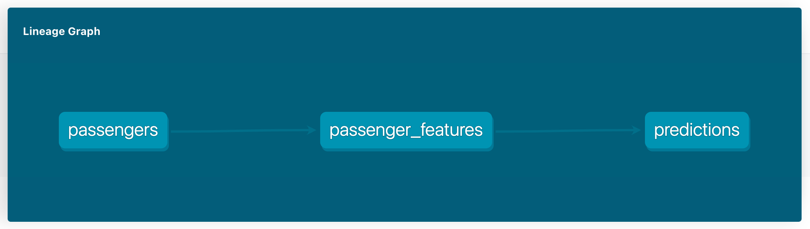

# Predicting Titanic survivals in the dbt DAG

In this tutorial, we will see how to build an end-to-end ML pipeline with the opensource [Layer dbt Adapter](https://github.com/layerai/dbt-adapters).

The Layer dbt Adapter lets you easily enhance your dbt pipelines with machine learning (ML) workloads.

In this example, we use a pre-trained model to apply predictions to a dataset. We are using the [Titanic survival model](https://app.layer.ai/layer/titanic) available as a public project in [Layer.ai](https://layer.ai/) to illustrate how this works.

We do this in a dbt pipeline with two stages:

- First, we build a dbt model to shape our data into the features required by the model. We call this dbt model `passenger_features`.
- Then, we build a second dbt model which applies the [Titanic survival model](https://app.layer.ai/layer/titanic) to the `passenger_features` data to predict the survival of the Titanic passengers.

The Layer dbt adapter provides a simple SQL function that seamlessly integrates the ML Model in the dbt pipeline without the need to step out from our familiar SQL language.

This is all the code we need to apply our ML model:

```sql
SELECT
       PassengerId,
       layer.predict("layer/titanic/models/survival_model:4.8",ARRAY[Pclass, Sex, Age, SibSp, Parch, Fare])
FROM
     {{ref('passenger_features')}}
```

The resulting dbt pipeline should look like this:



## How to run

First, install the open-source [Layer dbt Adapter](https://github.com/layerai/dbt-adapters) corresponding to your Data Warehouse of choice.
At the moment, we only support Google BigQuery (more to come soon).

```shell
pip install dbt-layer[bigquery] -U -q
```

The machine learning model we are going to use is a Scikit-Learn model, let's install the required library:

```shell
pip install scikit-learn==1.0.2
```

Then, add a new BigQuery profile to your [dbt profile](https://docs.getdbt.com/dbt-cli/configure-your-profile/).
Name it as `layer-profile` to match the example code, and don't forget to set `type: layer_bigquery` for Layer to work.

Here is a sample profile:

```yaml
layer-profile:
  target: dev
  outputs:
    dev:
      type: layer_bigquery
      method: service-account
      project: [GCP project id]
      dataset: [the name of your dbt dataset]
      threads: [1 or more]
      keyfile: [/path/to/bigquery/keyfile.json]
```

Now, are are ready to run the example.

To get the code, clone this repo, and go to the `titanic` example folder:

```shell
git clone https://github.com/layerai/examples-dbt
cd examples-dbt/titanic
```

The example is self-contained and includes sample data that we need to insert in our DWH.
Seed the sample dataset [passengers.csv](seeds/passengers.csv), which lists the Titanic passengers and their known data.
This dataset comes from the [Titanic Kaggle Project](https://www.kaggle.com/c/titanic)

```shell
dbt seed
```

Finally, you can run the project:

```shell
dbt run
```

## Machine Learning (ML) Model

In this dbt example, we use a pre-trained [survival](https://app.layer.ai/layer/titanic/models/survival_model) machine learning model from [Layer](https://layer.ai/).

This model was trained on [Titanic Kaggle Project](https://www.kaggle.com/c/titanic) data from [Kaggle](https://www.kaggle.com/) and can be used the predict the survivals of the Titanic disaster.

To learn more about this machine learning model:

https://app.layer.ai/layer/titanic
